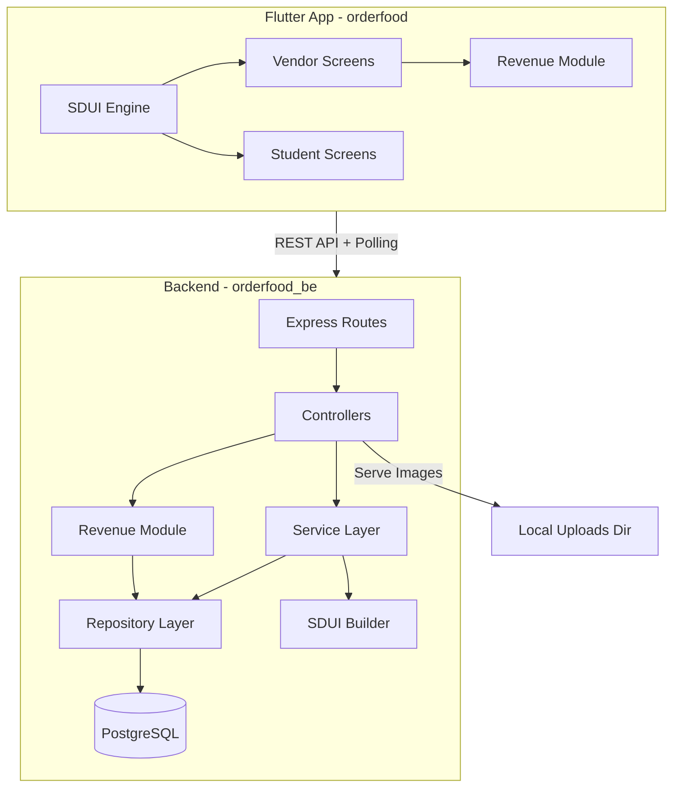
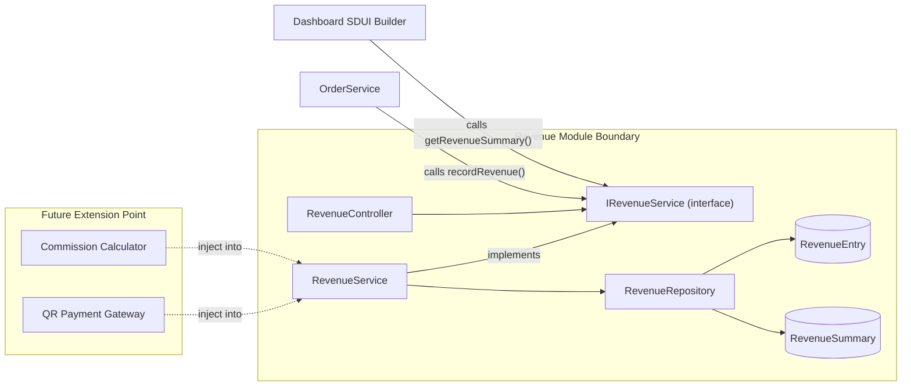

# OrderFood - SDUI Food Ordering App

## Architecture Overview




## Tech Stack

**Backend:**

- Runtime: Node.js + TypeScript (strict mode)
- Framework: Express.js
- ORM: Prisma (excellent TypeScript integration, migrations)
- Validation: Zod
- Auth: JWT (jsonwebtoken + bcrypt)
- File Upload: Multer (local disk)
- Testing: Jest + Supertest

**Flutter:**

- State Management: Riverpod
- HTTP Client: Dio
- Architecture: Feature-first with clean architecture layers
- SDUI: Custom rendering engine that maps JSON component types to Flutter widgets

## SDUI Design

The server returns a JSON payload describing both **layout structure** and **data** for each screen. The Flutter SDUI engine parses this and renders native widgets.

Example SDUI response for the vendor dashboard:

```json
{
  "screen": "vendor_dashboard",
  "version": 1,
  "components": [
    {
      "type": "statsRow",
      "children": [
        { "type": "statCard", "props": { "label": "Orders Today", "value": "{{revenue.todayOrderCount}}", "icon": "shopping_cart" } },
        { "type": "statCard", "props": { "label": "Revenue Today", "value": "{{revenue.todayNetFormatted}}", "icon": "currency_rupee" } },
        { "type": "statCard", "props": { "label": "Total Revenue", "value": "{{revenue.overallNetFormatted}}", "icon": "account_balance" } }
      ]
    },
    {
      "type": "sectionHeader",
      "props": { "title": "Recent Orders" }
    },
    {
      "type": "list",
      "children": [
        { "type": "orderTile", "props": { "id": "ORD-101", "student": "Rahul", "total": "Rs 150", "status": "pending" } }
      ]
    }
  ],
  "actions": {
    "onOrderTap": { "type": "navigate", "route": "/vendor/orders/:id" }
  }
}
```

The SDUI engine on Flutter uses a **Component Registry** (Factory Pattern) to map `"type"` strings to widget builders. This means I (the developer) can add new component types on both sides, and rearrange/redesign screens entirely from the backend without app updates.

## Database Schema (Prisma)

**Core Tables:**

```
User         -> id, email, passwordHash, role (VENDOR|STUDENT), createdAt
Vendor       -> id, userId (FK), restaurantName, description, createdAt
Student      -> id, userId (FK), name, createdAt
MenuItem     -> id, vendorId (FK), name, description, priceInPaise (Int), imageUrl, isAvailable, category, sortOrder, createdAt, updatedAt
Order        -> id, studentId (FK), vendorId (FK), status (PENDING|CONFIRMED|PREPARING|READY|DELIVERED|CANCELLED), totalAmountInPaise (Int), createdAt, updatedAt
OrderItem    -> id, orderId (FK), menuItemId (FK), quantity, priceAtOrderInPaise (Int)
SduiLayout   -> id, screenName, role, layoutJson, version, updatedAt
```

**Revenue Module Tables (isolated -- designed for future payment/commission extension):**

```
RevenueEntry    -> id, vendorId (FK), orderId (FK), grossAmountInPaise (Int), commissionInPaise (Int, default 0), netAmountInPaise (Int), currency (default "INR"), createdAt
RevenueSummary  -> id, vendorId (FK), date (Date), totalOrderCount (Int), grossRevenueInPaise (Int), totalCommissionInPaise (Int), netRevenueInPaise (Int), currency (default "INR"), updatedAt
```

All monetary values stored as **integers in paise** (1 INR = 100 paise) to avoid floating-point precision issues. The `commission` and `net` columns default to 0 / gross now but are structurally ready for the future QR payment + commission feature. `RevenueSummary` is a daily materialized aggregate that gets updated on each order completion, making dashboard queries fast without scanning all orders.

## API Endpoints

**Auth**

- `POST /api/auth/register` - Register (vendor or student)
- `POST /api/auth/login` - Login, returns JWT
- `GET /api/auth/me` - Current user profile

**Vendor**

- `GET /api/vendor/dashboard` - Returns SDUI JSON for dashboard (pulls live stats from revenue module)
- `GET /api/vendor/menu` - Returns SDUI JSON for menu management screen
- `POST /api/vendor/menu/items` - Create menu item (price in INR, stored as paise)
- `PUT /api/vendor/menu/items/:id` - Update menu item
- `PATCH /api/vendor/menu/items/:id/availability` - Toggle sold out / back in stock
- `POST /api/vendor/menu/items/:id/image` - Upload image (multipart)
- `DELETE /api/vendor/menu/items/:id` - Remove menu item
- `GET /api/vendor/orders` - List orders with filters

**Student**

- `GET /api/student/menu/:vendorId` - Returns SDUI JSON for browsable menu (polls this for real-time updates)
- `POST /api/student/orders` - Place an order (creates RevenueEntry on completion)
- `GET /api/student/orders` - Order history
- `GET /api/student/orders/:id` - Order detail

**Revenue (isolated module -- own routes, controller, service, repository)**

- `GET /api/revenue/today` - Today's revenue summary for authenticated vendor
- `GET /api/revenue/summary?from=&to=` - Revenue summary for a date range
- `GET /api/revenue/overall` - Lifetime revenue since signup
- `GET /api/revenue/entries?page=&limit=` - Paginated list of individual revenue entries (per-order breakdown)

**SDUI Admin (developer use)**

- `GET /api/sdui/layouts` - List all layouts
- `PUT /api/sdui/layouts/:screenName` - Update a screen layout template
- `GET /api/sdui/components` - List registered SDUI component types

**Static**

- `GET /uploads/:filename` - Serve uploaded images

## Design Patterns

**Backend (SOLID + Patterns):**

- **Repository Pattern** - Each entity gets a repository class abstracting Prisma queries behind an interface
- **Service Layer** - Business logic lives in services, never in controllers
- **Dependency Injection** - Services receive repositories via constructor injection (using tsyringe)
- **Factory Pattern** - SDUI component builders registered in a factory/registry
- **Builder Pattern** - SDUI screen responses constructed via a fluent ScreenBuilder
- **Strategy Pattern** - Different dashboard stat calculators (daily, weekly, overall) share a common interface
- **Module Pattern** - Revenue logic is a fully self-contained module (`src/modules/revenue/`) with its own controller, service, repository, routes, and types. Other modules interact with it only through its public service interface (e.g., `IRevenueService`). This makes it trivial to later inject commission calculation, payment gateway hooks, or QR code settlement without touching order logic.

**Flutter (SOLID + Patterns):**

- **Feature-first architecture** - Each feature (auth, vendor dashboard, student menu) is a self-contained module
- **Repository Pattern** - Data sources abstracted behind repository interfaces
- **Factory Pattern** - SDUI ComponentRegistry maps type strings to widget builder functions
- **Provider/Riverpod** - Dependency injection and state management

## Project Structure

```
orderfood/                          # root workspace
├── orderfood_be/                   # Backend (Node.js/TypeScript)
│   ├── src/
│   │   ├── config/                 # env, database, constants
│   │   ├── controllers/            # route handlers (thin)
│   │   ├── services/               # business logic
│   │   ├── repositories/           # data access layer
│   │   ├── modules/
│   │   │   └── revenue/            # *** ISOLATED REVENUE MODULE ***
│   │   │       ├── revenue.controller.ts
│   │   │       ├── revenue.service.ts
│   │   │       ├── revenue.repository.ts
│   │   │       ├── revenue.routes.ts
│   │   │       ├── revenue.types.ts
│   │   │       └── index.ts        # public API barrel export
│   │   ├── sdui/
│   │   │   ├── components/         # component type definitions
│   │   │   ├── builders/           # screen builders (dashboard, menu, etc.)
│   │   │   └── registry.ts         # component registry
│   │   ├── middleware/              # auth, validation, error handler
│   │   ├── routes/                 # Express route definitions
│   │   ├── types/                  # shared TypeScript interfaces
│   │   ├── utils/
│   │   │   └── currency.ts         # INR/paise conversion helpers
│   │   └── app.ts                  # Express app setup + entry
│   ├── prisma/
│   │   └── schema.prisma
│   ├── uploads/                    # local image storage
│   ├── tests/
│   │   ├── revenue/                # dedicated revenue module tests
│   │   └── ...                     # other integration tests
│   ├── package.json
│   └── tsconfig.json
│
├── orderfood/                      # Flutter app
│   ├── lib/
│   │   ├── core/
│   │   │   ├── di/                 # Riverpod providers
│   │   │   ├── network/            # Dio API client, interceptors
│   │   │   ├── sdui/               # SDUI engine (parser, renderer, registry)
│   │   │   ├── currency/           # INR formatting, paise conversion helpers
│   │   │   └── theme/              # App theme
│   │   ├── features/
│   │   │   ├── auth/               # Login/register (placeholder)
│   │   │   ├── vendor/
│   │   │   │   ├── dashboard/      # Dashboard screen (pulls from revenue module)
│   │   │   │   ├── menu/           # Menu management
│   │   │   │   └── orders/         # Order management
│   │   │   ├── student/
│   │   │   │   ├── menu/           # Browse menu
│   │   │   │   └── orders/         # Place & track orders
│   │   │   └── revenue/            # *** ISOLATED REVENUE FEATURE ***
│   │   │       ├── data/
│   │   │       │   ├── revenue_repository.dart
│   │   │       │   └── revenue_api.dart
│   │   │       ├── domain/
│   │   │       │   ├── revenue_entry.dart
│   │   │       │   └── revenue_summary.dart
│   │   │       └── presentation/
│   │   │           ├── revenue_provider.dart
│   │   │           └── revenue_widgets.dart
│   │   ├── shared/
│   │   │   ├── models/
│   │   │   └── widgets/
│   │   └── main.dart
│   └── pubspec.yaml
│
└── requirements/
    └── first_draft.md              # (existing)
```

## Revenue Module -- Isolation Strategy

The revenue system is designed as a **fully decoupled module** in both backend and Flutter. This ensures the future addition of QR code payments, payment gateways, and commission logic requires changes **only inside the revenue module** without touching order, menu, or dashboard code.




**How it works now:**

- When an order is marked DELIVERED, `OrderService` calls `revenueService.recordRevenue(order)` -- this creates a `RevenueEntry` row (commission = 0, net = gross) and upserts the daily `RevenueSummary`.
- Dashboard SDUI builder calls `revenueService.getTodaySummary(vendorId)` and `revenueService.getOverallSummary(vendorId)` to fill in the stat cards with real data.

**How it extends later:**

- Inject a `CommissionCalculator` strategy into `RevenueService` to compute commission per order.
- Add a `PaymentService` that handles QR code generation and payment confirmation, then calls `revenueService.recordRevenue()` with payment metadata.
- The `RevenueEntry` table already has `commissionInPaise` and `netAmountInPaise` columns ready.

## Implementation Phases

### Phase 1: Backend Foundation

Set up the `orderfood_be/` Node.js/TypeScript project with Express, Prisma, PostgreSQL connection, project structure, error handling middleware, auth (JWT), and currency utility helpers (paise/INR conversion). Seed initial data.

### Phase 2: Revenue Module (Backend)

Build the isolated revenue module first: `RevenueEntry` and `RevenueSummary` Prisma models, `IRevenueService` interface, `RevenueService`, `RevenueRepository`, `RevenueController`, and `/api/revenue/`* routes. All monetary values in paise (Int) with `currency.ts` helpers for display formatting.

### Phase 3: SDUI Engine (Backend)

Build the SDUI component registry, screen builder system, and the `/api/sdui/`* endpoints. Define the JSON schema contract that Flutter will consume.

### Phase 4: Vendor Features (Backend)

Implement menu CRUD with image upload (Multer), availability toggling, order listing, and dashboard SDUI builder that pulls real revenue data from the revenue module. Menu prices in INR (stored as paise).

### Phase 5: Student Features (Backend)

Implement student-facing menu endpoint (SDUI-driven, reflects vendor changes), order placement (triggers `revenueService.recordRevenue()` on order completion), order history. Wire up SDUI builders for student screens.

### Phase 6: Backend Testing

Write integration tests with Jest + Supertest covering auth flow, menu CRUD, order placement, **revenue recording and aggregation**, SDUI response structure, and image uploads. Revenue module gets its own dedicated test suite.

### Phase 7: Flutter App Code

Write the full Flutter codebase: SDUI rendering engine, Dio API client, Riverpod providers, vendor screens (dashboard with live revenue data, menu management), student screens (menu browse, order placement), **isolated revenue feature module** (`features/revenue/`), currency formatting utilities, and navigation.

## Constraints / Notes

- All monetary values stored as **integers in paise** (1 INR = 100 paise) to avoid floating-point issues. Display formatting (`"Rs 3,200.00"`) handled by `currency.ts` on backend and `currency/` utils on Flutter.
- Revenue is **never hardcoded** -- all dashboard numbers come from `RevenueEntry` / `RevenueSummary` tables, calculated from actual completed orders.
- Revenue module is **completely isolated**: own directory, own routes, own service interface. Other modules call it only through `IRevenueService`. Future payment/commission changes stay inside this boundary.
- Flutter code will be written but **not compiled or tested** (no Flutter SDK available). Code quality ensured via patterns and conventions.
- Backend will be fully runnable and testable. Requires PostgreSQL running locally or via Docker.
- Polling interval for students: configurable, default 15 seconds.
- Auth login screen is a placeholder per user's note ("I'll set up later"), but the JWT infrastructure will be fully built.
- Flutter project folder: `orderfood/orderfood/`, Backend project folder: `orderfood/orderfood_be/`.

